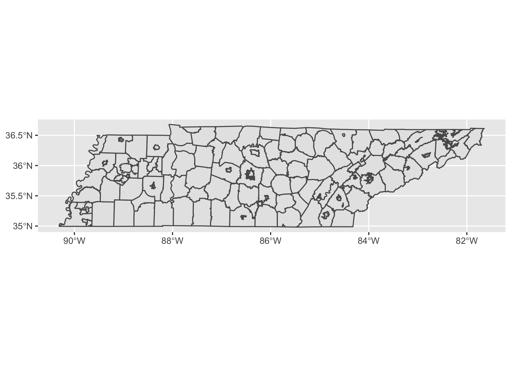
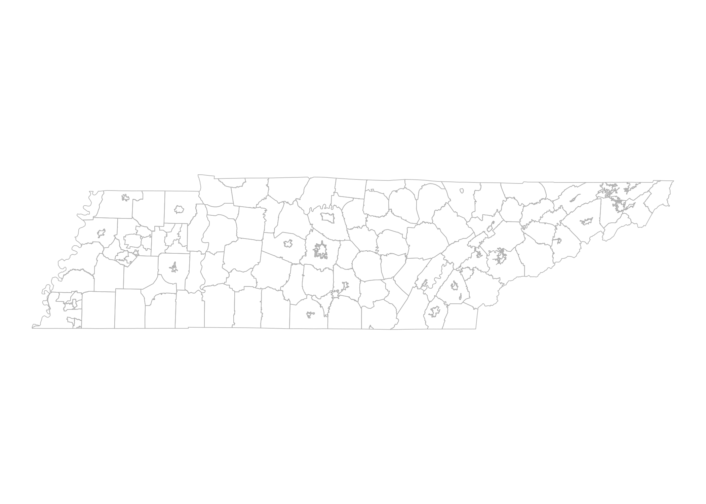

<!-- README.md is generated from README.Rmd. Please edit that file -->

# leaidr 

<!-- badges: start -->

<!-- badges: end -->

The goal of leaidr is to provide an easy way to map U.S. school
districts in R.

## Installation

You can install the development version of this package from
[GitHub](https://github.com/) with:

``` r
# install.packages("devtools")
devtools::install_github("ivelasq/leaidr")
```

## About

The original shapefiles can be found on the [National Center for
Education
Statistics](https://nces.ed.gov/programs/edge/Geographic/DistrictBoundaries)
site. These files are from 2019.

We’ll work on adding state names/abbreviation so we don’t have to use
FIPS.

## Load the U.S. Shapefile

Load the shapefile for the entire U.S. using `load_shapefile()`. **You
must have a GITHUB\_PAT.** You can set a token in your [developer
settings](https://github.com/settings/tokens) and save it in your R
Environment. More info can be found in [Happy Git with
R](https://happygitwithr.com/github-pat.html).

Loading may take a while - large files were uploaded to Github using
{piggyback}. Once you have loaded it, you shouldn’t have to do it again
unless you delete the package.

## Create a Shapefile

Run the function `create_shapefile()` to create a shapefile with
district boundaries. If you want the entire U.S., then designate `fips =
"All"`. If you want a specific state, then designate it with the state
abbrevation `fips = "47"`. To designate multiple states, designate it in
a vector `fips = c("47", "06")`.

## Use the Data

Once you have the shapefile, you can merge other data using `merge()`.
You can also plot the shapefiles in {leaflet} and {ggplot2}.

### Leaflet Example

``` r
library(leaidr)
library(leaflet)

# if you haven't loaded the shapefile
# load_shapefile()

tn <- create_shapefile(fips = "47")
#> OGR data source with driver: ESRI Shapefile 
#> Source: "/Users/shortessay/leaidr/default/Downloads", layer: "schooldistrict_sy1819_tl19"
#> with 13315 features
#> It has 18 fields

leaflet(tn) %>% 
  addPolygons(weight = 0.3, 
              smoothFactor = 0.5,
              opacity = 1.0, 
              color = "white") %>% 
  setView(-86.5804, 35.5175, zoom = 6)
```



### ggplot2 Example

``` r
library(leaidr)
library(tidyverse)

# if you haven't loaded the shapefile
# load_shapefile()

tn <- create_shapefile(fips = "47")
#> OGR data source with driver: ESRI Shapefile 
#> Source: "/Users/shortessay/leaidr/default/Downloads", layer: "schooldistrict_sy1819_tl19"
#> with 13315 features
#> It has 18 fields
tn_df <- ggplot2::fortify(tn)

map <-
  ggplot() +
  geom_path(data = tn, 
            aes(x = long, y = lat, group = group),
            color = "gray", size = .2) +
  theme_void()

map_projected <- map +
  coord_map()

print(map_projected)
```


